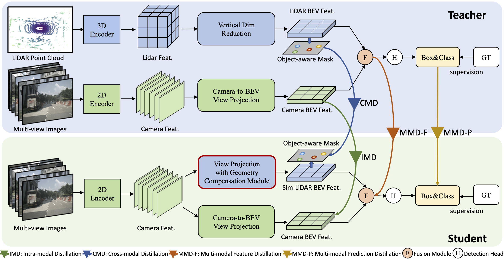
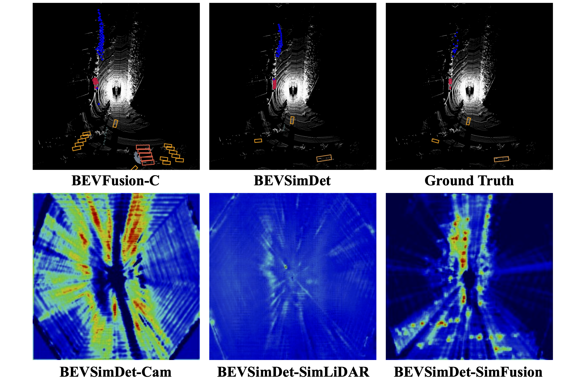

# BEVSimDet
The official repo for [Arxiv'23] "BEVSimDet: Simulated Multi-modal Distillation in Bird’s-Eye View for Multi-view 3D Object Detection"
## News

- **(2023/3/29)** BEVFusion is released on [arXiv](https://arxiv.org/abs/2303.16818).

## Abstract

Multi-view camera-based 3D object detection has gained popularity due to its low cost. But accurately inferring 3D geometry solely from camera data remains challenging, which impacts model performance. One promising approach to address this issue is to distill precise 3D geometry knowledge from LiDAR data. However, transferring knowledge between different sensor modalities is hindered by the significant modality gap. In this paper, we approach this challenge from the perspective of both architecture design and knowledge distillation and present a new simulated multi-modal 3D object detection method named BEVSimDet. We first introduce a novel framework that includes a LiDAR and camera fusion-based teacher and a simulated multi-modal student, where the student simulates multi-modal features with image-only input. To facilitate effective distillation, we propose a simulated multi-modal distillation scheme that supports intra-modal, cross-modal, and multi-modal distillation simultaneously. By combining them together, BEVSimDet can learn better feature representations for 3D object detection while enjoying cost-effective camera-only deployment. Experimental results on the challenging nuScenes benchmark demonstrate the effectiveness and superiority of BEVSimDet over recent representative methods.
## Approach overview


## Results

### Quantitative results on Nuscenes val
|        Model         | Modality | Camera Backbone | mAP  | NDS  | 
| :------------------: | :------: |:--------------: | :--: | :--: | 
| [BEVFusion-C] |    C     | SwinT | 35.5 | 41.2 |
| [BEVSimDet] |    C     | SwinT | 40.4 | 45.3 |
| [BEVSimDet] |    C     | ViTAEv2-S | 40.1 | 46.3 |
### Qualitative results



## Usage

### Prerequisites

The code is built with following libraries:

- Python >= 3.8, \<3.9
- OpenMPI = 4.0.4 and mpi4py = 3.0.3 (Needed for torchpack)
- Pillow = 8.4.0 (see [here](https://github.com/mit-han-lab/bevfusion/issues/63))
- [PyTorch](https://github.com/pytorch/pytorch) >= 1.9, \<= 1.10.2
- [tqdm](https://github.com/tqdm/tqdm)
- [torchpack](https://github.com/mit-han-lab/torchpack)
- [mmcv](https://github.com/open-mmlab/mmcv) = 1.4.0
- [mmdetection](http://github.com/open-mmlab/mmdetection) = 2.20.0
- [nuscenes-dev-kit](https://github.com/nutonomy/nuscenes-devkit)

After installing these dependencies, please run this command to install the codebase:

```bash
python setup.py develop
```
### Codes coming soon...
